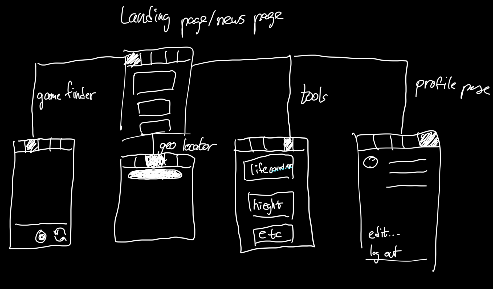
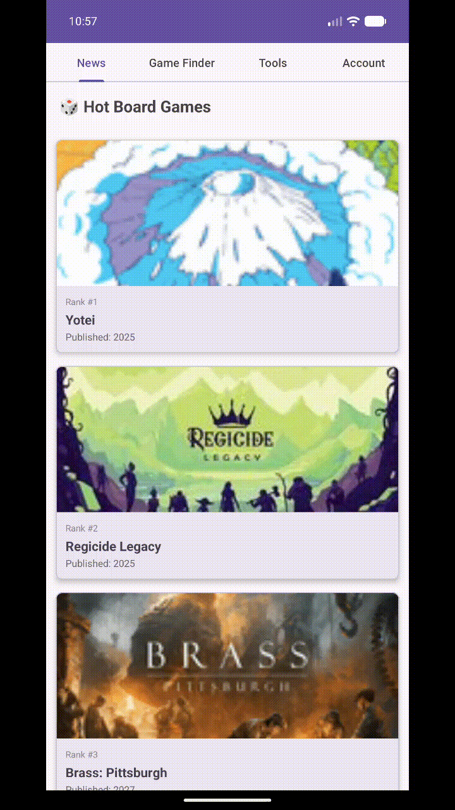

# Milestone 1 - Board Game Companion App (Unit 7)

## Table of Contents
- [Overview](#overview)
- [Product Spec](#product-spec)
- [Wireframes](#wireframes)

---

## Overview

### Description

Board Game Companion is a mobile app designed to enhance the tabletop gaming experience. Users can discover nearby board game stores using GPS and maps, identify games and get assistance with rules through a built-in AI chat wrapper, and use their phone's accelerometer and gyroscope to roll dice. The app also supports height and distance parameter calculations for games that require physical measurements, and provides a news feed of trending board games pulled from BoardGameGeek.

### App Evaluation

- **Category:** Entertainment / Gaming / Lifestyle
- **Mobile:** Yes (Android-focused) — leverages GPS, camera, accelerometer, gyroscope, and maps, making it inherently mobile-first
- **Story:** I love board games, and I'm sure many others do too. Finding local stores, learning new game rules on the fly, and having a digital dice roller all in one place makes the tabletop experience smoother and more accessible for everyone at the table.
- **Market:** Large — anyone who enjoys board games, card games, or tabletop RPGs. The market spans casual players to dedicated hobbyists, and the store finder feature benefits both new and experienced players looking to grow their collection.
- **Habit:** Low to medium direct usage — the app itself isn't the main focus, but what it supports is. The addictiveness of the app is largely dependent on the user and how much they enjoy the games it helps them play. By proxy, the more they play, the more they reach for the app.
- **Scope:** Moderate to broad — the app combines maps and location services, image recognition, a chat-based rules assistant, sensor-based dice rolling, and a live board game news feed. The core features are well-defined, with room to expand into community and collection tracking features in later milestones.

---

## Product Spec

### 1. User Features (Required and Optional)

**Required Features**

- View trending board games via BoardGameGeek news feed (scrollable cards)
- Search for board games by name using the BGG API
- Find nearby board game stores using GPS and Google Maps
- Roll dice using the device accelerometer and gyroscope (shake to roll)
- Basic tools: tip calculator, unit converter, password generator

**Optional Features**

- AI-powered chat wrapper to identify board games from a photo and assist with rules questions
- Height and distance parameter calculator for games that require physical measurements (e.g., line of sight, range rulers)
- Save favorite games and stores locally
- Share store locations or game results with other players

### 2. Screen Archetypes

- **News / Hot Games Feed**
    - User can scroll through trending board games pulled live from BoardGameGeek
    - Each card shows game rank, name, thumbnail, and year published

- **Game Finder**
    - User can search any board game by name via BGG search API
    - Results display game name and publish year

- **Store Finder Map**
    - User can view nearby board game stores on an interactive Google Map
    - App uses device GPS to center the map on the user's current location
    - Store pins are displayed using the Google Places API

- **Tools**
    - Dice roller using accelerometer and gyroscope — shake the device to roll
    - Height and distance parameter calculator for in-game measurements
    - Tip calculator, unit converter, and password generator

- **Account**
    - User can register and log in locally
    - User can set a profile photo from their device gallery
    - Account data stored locally using SharedPreferences

### 3. Navigation

**Tab Navigation (left to right via ViewPager2)**

- News
- Game Finder
- Store Finder Map
- Tools
- Account

**Flow Navigation**

- News Feed → Tap card → Game detail view (future milestone)
- Game Finder → Search results → Game detail view (future milestone)
- Store Finder → Map pins → Store detail popup
- Tools → Dice roller / Calculator / Utilities

---

## Wireframes

---

## API Reference

- **BoardGameGeek XML API 2** — `https://boardgamegeek.com/xmlapi2/`
    - No API key required
    - Used for hot games feed and game search
- **Google Maps SDK for Android** — interactive map display and GPS centering
- **Google Places API** — nearby board game store discovery

# Milestone 2 - Build Sprint 1 (Unit 8)

## GitHub Project board

## Issue cards

## Issues worked on this sprint

# Milestone 3 - Build Sprint 2 (Unit 9)

## GitHub Project board

## Completed user stories

## App Demo Video

- Embed the YouTube/Vimeo link of your Completed Demo Day prep video
